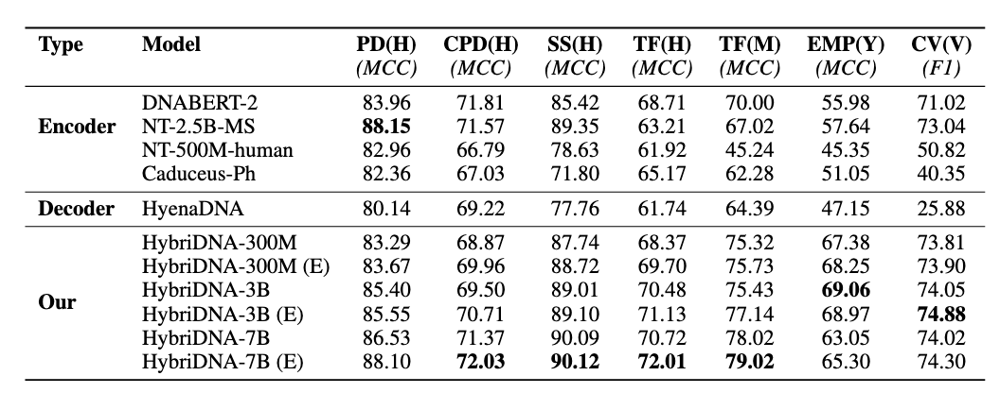
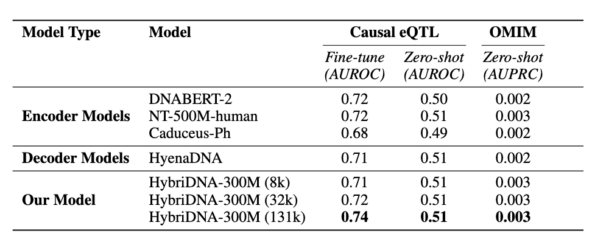
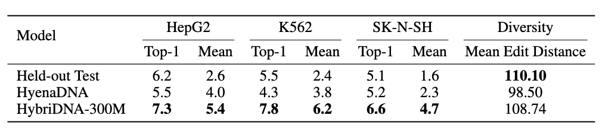
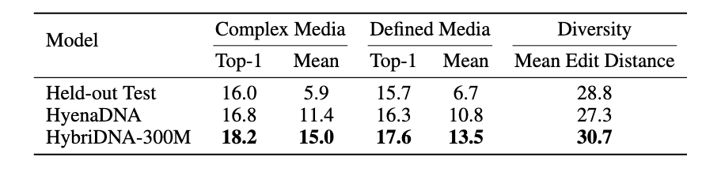
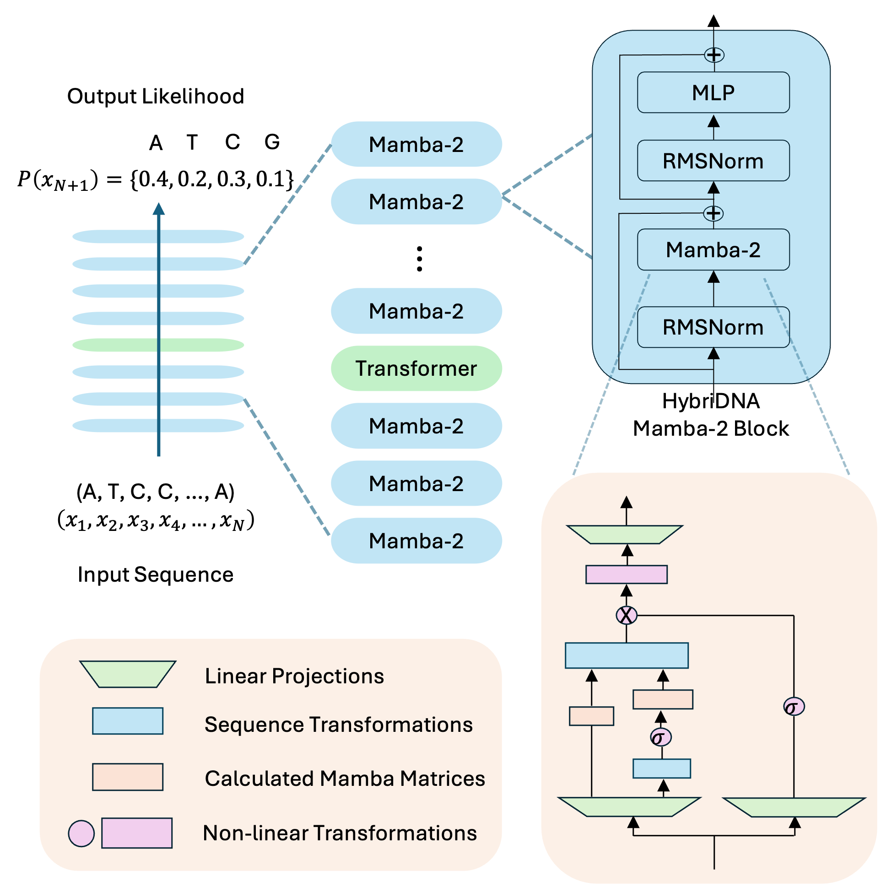
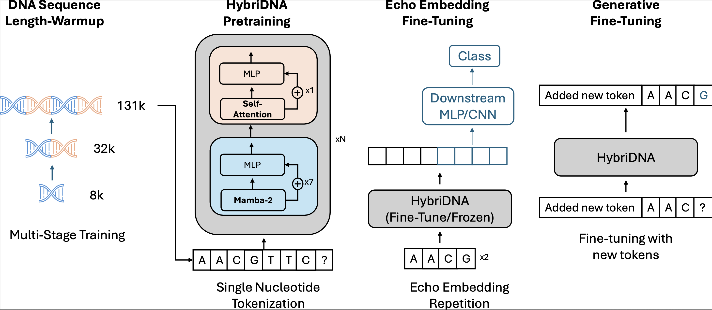

# A Hybrid Transformer-Mamba2 Long-Range DNA Language Model

[Read the Full Paper](#)

---

## 📄 Abstract
Advances in NLP and large language models have sparked interest in modeling DNA, the “language of life.” However, DNA modeling poses unique challenges...

**Key Highlights:**

- Processes sequences up to 131kb
- Combines Transformer and Mamba2 blocks
- Echo Embedding for understanding fine-tuning
- Achieves SOTA performance on BEND, GUE, LRB benchmarks
- Generative ability to design various functional sequences

---

## 🧪 Benchmark Results

### **GUE Benchmark**

### **BEND Benchmark**

### **LRB Benchmark**

---

## 🧬 DNA Generation

### **Synthetic cis-regulatory elements (CREs)**

- **Human Enhancers:** 
  

- **Yeast Promoters:** 
  

---

## 🏗️ Architecture Details
HybriDNA integrates:
- **Transformer Attention Mechanisms** for fine-grained details
- **Mamba2 Selective State-Space Models** for efficient long-sequence processing

---

## ⚙️ Methodology
1. **Pretraining:** Multi-species genomes using next-token prediction.
2. **Fine-tuning:** Echo embedding for understanding tasks.
3. **Generative Modeling:** Task-specific prompts for synthetic DNA design.

---

## 📬 Contact
For inquiries, reach out to the **HybriDNA Team** at [mamq@umich.edu](mailto:mamq@umich.edu).

---

_Powered by GitHub Pages & Jekyll (Cayman Theme)._
